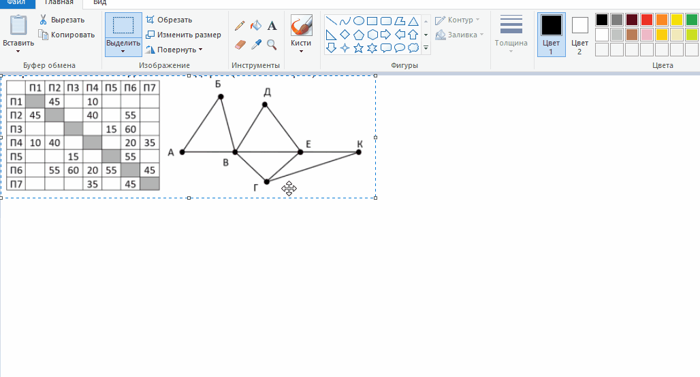
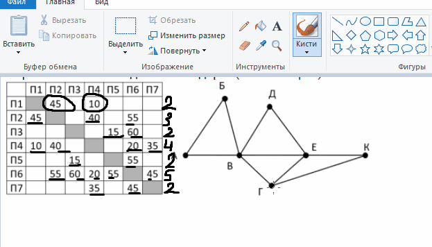
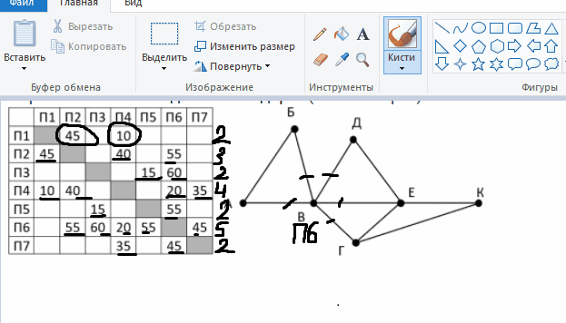
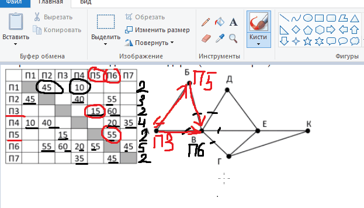
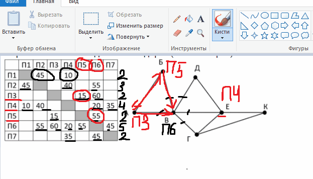
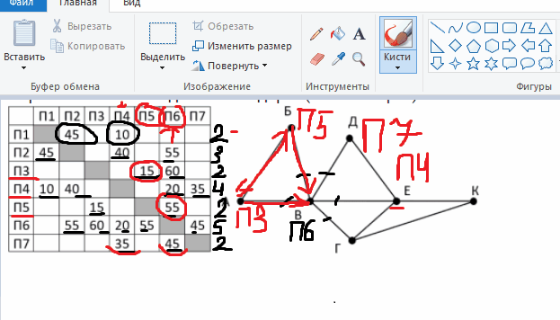
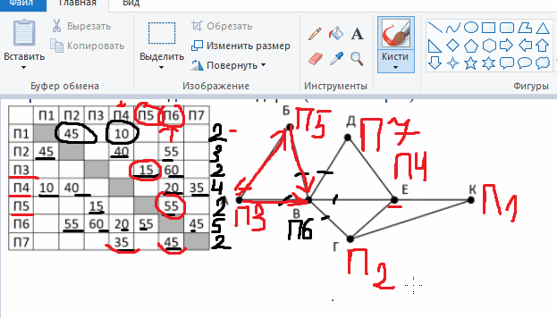

## 📌 Введение

Задание №1 ЕГЭ по информатике проверяет умение анализировать простые информационные модели, представленные в виде таблиц (матриц смежности) и графов (схем дорог). Часто требуется найти кратчайший путь между двумя точками или установить соответствие между номерами в таблице и буквами на схеме.

**Основные типы задач:**
- Найти сумму протяжённостей дорог между двумя точками.  
- Установить соответствие между номерами в таблице и буквами на схеме.  
- Найти количество возможных маршрутов или определить наличие/отсутствие пути.

## 🔍 Теория: Что такое информационная модель?

Информационная модель — это способ представления реального объекта или процесса с помощью данных и их связей.

В контексте задания №1:
- **Таблица** — матрица смежности, где строки и столбцы — это населённые пункты, а ячейки — расстояния между ними (или звёздочка `*`, если дороги нет).
- **Граф** — схема, где вершины — населённые пункты, а рёбра — дороги между ними.

> **Важно:** Таблица и схема составлены независимо друг от друга. Нумерация в таблице **не связана** с буквами на схеме. Это ключевой момент!
## 🧩 Пример решения задачи №1

### Условие задачи

На рисунке схема дорог Н-ского района изображена в виде графа, а в таблице приведены длины этих дорог (в километрах).

> **Важно!** Таблицу и схему составляли независимо друг от друга. Это значит, что пункты в таблице (П1, П2, П3...) никак не связаны с буквами на схеме (А, Б, В...). Наша задача — установить соответствие между ними.

**Вопрос:** Чему равна протяжённость дороги из пункта **К** в пункт **Г**? Ответ запишите целым числом.

---

### 🔍 Шаг 1. Анализ таблицы

Сначала посмотрим на таблицу и определим, сколько дорог выходит из каждого пункта (то есть сколько чисел стоит в каждой строке):

- **П1**: соединён с П2 и П4 → **2 дороги**  
- **П2**: соединён с П1, П4, П6 → **3 дороги**  
- **П3**: соединён с П5 и П6 → **2 дороги**  
- **П4**: соединён с П1, П2, П6, П7 → **4 дороги**  
- **П5**: соединён с П3 и П6 → **2 дороги**  
- **П6**: соединён с П2, П3, П4, П5, П7 → **5 дорог**  
- **П7**: соединён с П4 и П6 → **2 дороги**

---

### 🔍 Шаг 2. Анализ схемы

Теперь посмотрим на граф и посчитаем, сколько рёбер (дорог) выходит из каждой вершины:

- У **В** — 5 дорог → это уникальный пункт!  
- У **Е** — 4 дороги  
- У **Г** — 3 дороги  
- У **А, Б, Д, К** — по 2 дороги

Поскольку **только один** пункт в таблице имеет 5 дорог — это **П6**, а на схеме — только **В**, значит:

> **В ↔ П6**

---

### 🔍 Шаг 3. Определяем пункты А и Б

Пункты **А** и **Б** соединены только между собой и с пунктом **В** (П6). У каждого из них — по 2 дороги.

В таблице ищем два пункта, которые:
- соединены между собой,
- соединены с **П6**,
- и больше ни с кем не соединены.

Это **П3** и **П5**.

> **А и Б ↔ П3 и П5** (точное соответствие пока не важно).

---

### 🔍 Шаг 4. Находим пункт Е

На схеме у пункта **Е** — 4 дороги. В таблице такой пункт тоже один — **П4**.

> **Е ↔ П4**

---

### 🔍 Шаг 5. Определяем пункт Д

Пункт **Д** соединён только с **Е** и **В** (то есть с П4 и П6). У него 2 дороги.

В таблице такой пункт — **П7**.

> **Д ↔ П7**

---

### 🔍 Шаг 6. Определяем К и Г

Остались неопознанными:
- На схеме: **К** (2 дороги), **Г** (3 дороги)  
- В таблице: **П1** (2 дороги), **П2** (3 дороги)

Сопоставляем:
- **К ↔ П1**  
- **Г ↔ П2**

---

### ✅ Шаг 7. Находим ответ

Нас просят найти длину дороги **из К в Г** → это **из П1 в П2**.

Смотрим в таблицу: на пересечении **П1** и **П2** стоит число **45**.

> **Ответ: 45**
