## Основные логические операции

В математической логике используются два возможных значения высказываний:  
- **Истина** (`True` или `1`)  
- **Ложь** (`False` или `0`)

В рамках ЕГЭ по информатике рассматриваются не все логические операции, а только пять ключевых. Ниже приведены их определения и таблицы истинности.

### 1. Отрицание (¬A или NOT)

Отрицание меняет значение логического выражения на противоположное.

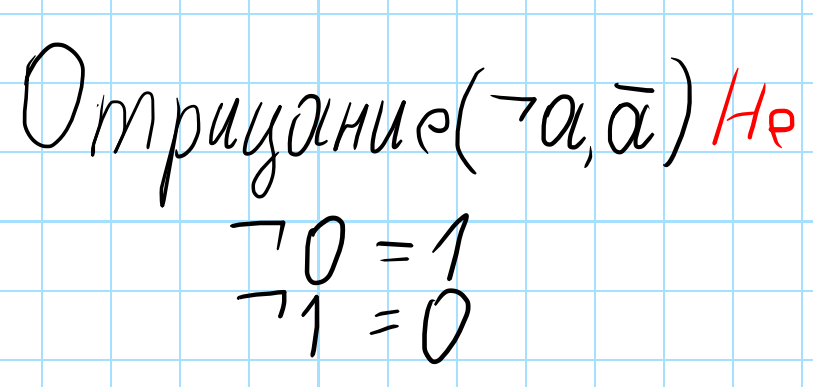

### 2. Конъюнкция (A ∧ B или AND)

Конъюнкция истинна только тогда, когда **оба** операнда истинны.

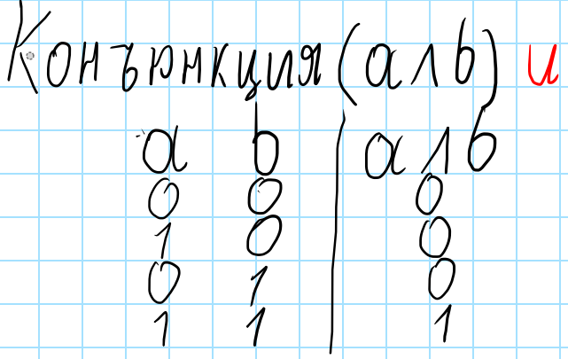

### 3. Дизъюнкция (A ∨ B или OR)

Дизъюнкция ложна только тогда, когда **оба** операнда ложны.

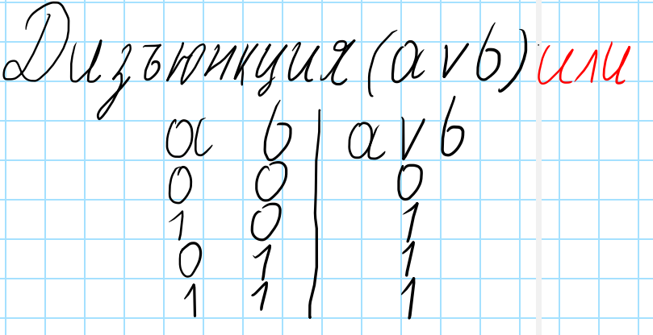

### 4. Импликация (A → B)

Импликация ложна **только** в случае, когда из истинного высказывания следует ложное.

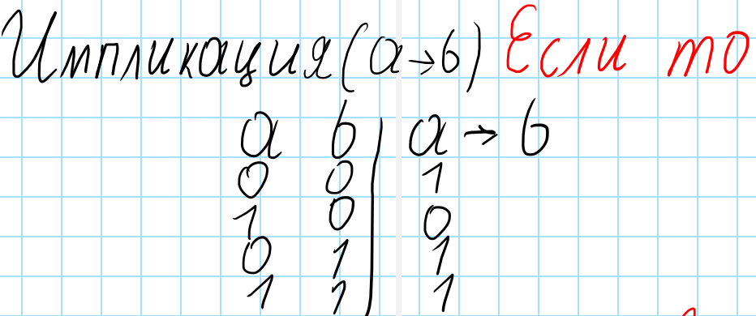

### 5. Эквиваленция (A ↔ B)

Эквиваленция истинна, когда оба высказывания **имеют одинаковое** логическое значение.

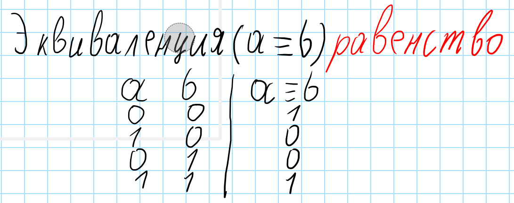

## Логические операции в Python

В Python логические операции записываются следующим образом:

| Логическая операция | Обозначение в Python |
|---------------------|----------------------|
| Отрицание (¬A)      | `not A`              |
| Конъюнкция (A ∧ B)  | `A and B`            |
| Дизъюнкция (A ∨ B)  | `A or B`             |
| Импликация (A → B)  | `A <= B`             |
| Эквиваленция (A ↔ B)| `A == B`             |

### Приоритет операций (без учёта скобок)

1. Выражения в скобках `(...)`
2. `not`
3. `and`
4. `or`
5. `<=` (импликация)
6. `==` (эквиваленция)

> ⚠️ **Важно!** В Python операции сравнения (включая `<=` и `==`) имеют **более высокий приоритет**, чем логические операторы `and` и `or`. Это отличается от математической логики, где импликация и эквиваленция выполняются **после** конъюнкции и дизъюнкции.

### Пример: нарушение порядка вычислений

Расставим приоритет. Согласно логике, первой должна выполняться конъюнкция (`and`), а затем — импликация (`<=`).

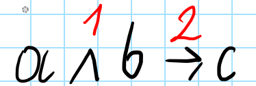

Перепишем это выражение так, как оно выглядело бы в Python:

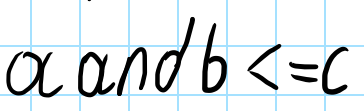

Однако здесь возникает особенность. В Python импликация моделируется через оператор сравнения `<=`, а конъюнкция — через логический оператор `and`. При этом **операции сравнения имеют более высокий приоритет**, чем логические операторы. Поэтому в действительности сначала выполнится импликация (`B <= C`), а уже потом — `A and (результат)`, что **нарушает заданный порядок**.

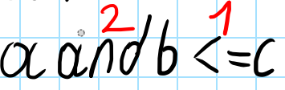

Чтобы соблюсти правильный порядок выполнения операций, необходимо явно повысить приоритет конъюнкции с помощью скобок:

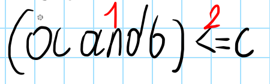

## Логические функции. Таблицы истинности

Рассмотрим пример построения таблицы истинности для логической функции двумя способами: вручную и с помощью программы.

### Ручное построение

Дана логическая функция:  
F = a and b or c

Прежде всего, учтём приоритет логических операций: сначала выполняется конъюнкция (`and`), затем дизъюнкция (`or`). Отметим порядок вычислений:

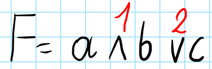

Далее строим таблицу истинности. Начинаем с того, что все переменные принимают значение `False` (`0`). Затем последовательно увеличиваем двоичное число, добавляя `1` к самой правой переменной, пока все переменные не станут `True` (`1`):

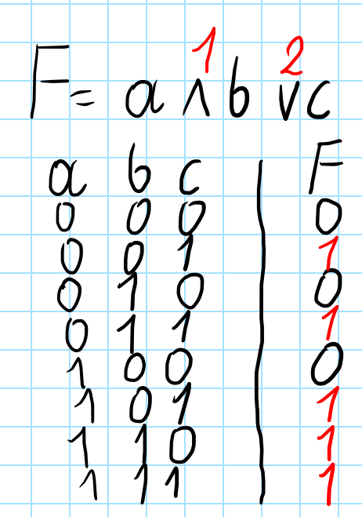

В таблице обязательно присутствует столбец `F`, в котором записываются результаты вычисления функции для каждой комбинации входных значений. Рассмотрим подробнее:

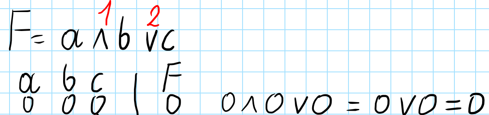

Возьмём первую строку: `a = 0`, `b = 0`, `c = 0`. Подставим эти значения в выражение:  
0 and 0 or 0

1. Сначала вычисляем `0 and 0`. Согласно таблице истинности конъюнкции, результат — `0`.  
2. Затем вычисляем `0 or 0`. Согласно таблице истинности дизъюнкции, результат — `0`.

Итоговое значение функции `F` в этой строке — `0`.

Аналогично вычисляем значение `F` для каждой строки таблицы:

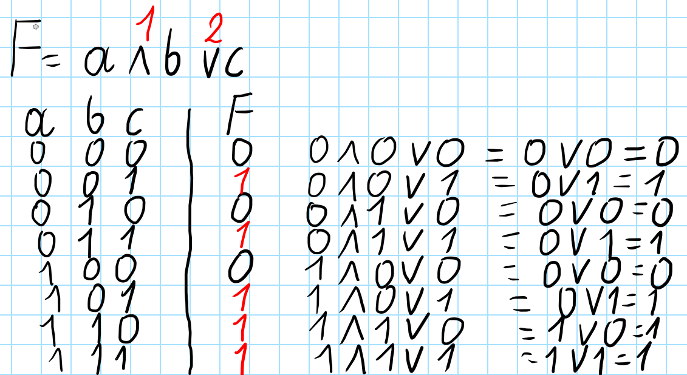

### Программное построение таблицы истинности

Для автоматического построения таблицы истинности можно использовать простой скрипт на Python. Ниже приведён пример программы, которая перебирает все возможные комбинации значений переменных `a`, `b` и `c`, вычисляет значение функции  

F = a and b or c

и выводит результат в виде таблицы.

```python
# Выводим заголовок таблицы истинности для наглядности
print('a b c | f')

# Перебираем все возможные значения логической переменной a (0 и 1)
for a in range(2):
    # Перебираем все возможные значения логической переменной b (0 и 1)
    for b in range(2):
        # Перебираем все возможные значения логической переменной c (0 и 1)
        for c in range(2):
            # Вычисляем значение логической функции f = a AND b OR c
            f = a and b or c
            
            # Выводим строку таблицы истинности
            print(a, b, c, "|", f)
```
#Результат
a b c | f
0 0 0 | 0
0 0 1 | 1
0 1 0 | 0
0 1 1 | 1
1 0 0 | 0
1 0 1 | 1
1 1 0 | 1
1 1 1 | 1

Если нас интересуют **только те строки**, в которых значение функции равно `0`, достаточно оставить проверку только на `f == 0` и убрать вывод для `f == 1`.

```python
# Выводим заголовок таблицы истинности для наглядности
print('a b c | f')

# Перебираем все возможные значения логической переменной a (0 и 1)
for a in range(2):
    # Перебираем все возможные значения логической переменной b (0 и 1)
    for b in range(2):
        # Перебираем все возможные значения логической переменной c (0 и 1)
        for c in range(2):
            # Вычисляем значение логической функции f = a AND b OR c
            f = a and b or c
            
            # Выводим только те строки, где f == 0
            if f == 0:
                print(a, b, c, "|", f)
```
#Результат
a b c | f
0 0 0 | 0
0 1 0 | 0
1 0 0 | 0

Если же нас интересуют **только строки**, в которых значение функции равно `1`, достаточно оставить проверку на `f == 1` и убрать вывод для `f == 0`.

```python
# Выводим заголовок таблицы истинности для наглядности
print('a b c | f')

# Перебираем все возможные значения логической переменной a (0 и 1)
for a in range(2):
    # Перебираем все возможные значения логической переменной b (0 и 1)
    for b in range(2):
        # Перебираем все возможные значения логической переменной c (0 и 1)
        for c in range(2):
            # Вычисляем значение логической функции f = a AND b OR c
            f = a and b or c
            
            # Выводим только те строки, где f == 1
            if f == 1:
                print(a, b, c, "|", f)
```
a b c | f
0 0 1 | 1
0 1 1 | 1
1 0 1 | 1
1 1 0 | 1
1 1 1 | 1


## Примеры решения задач ЕГЭ

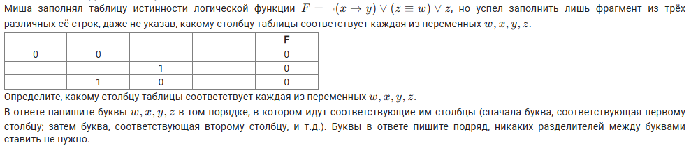

Нам дана **неполная таблица истинности**, которую необходимо восстановить и сопоставить столбцы с переменными. Решим задачу сначала **вручную**, а затем — **программно**.

### Шаг 1. Расстановка приоритетов операций

Анализируем логическое выражение и отмечаем порядок выполнения операций:

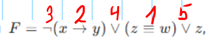

### Шаг 2. Построение полной таблицы истинности

Вычислим значение функции для всех возможных наборов входных переменных. Для наглядности разобьём вычисления по шагам, последовательно применяя каждую операцию:

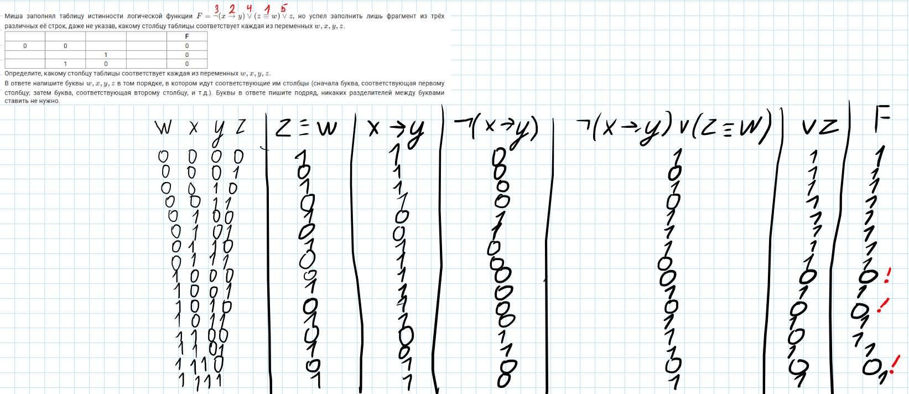

Из полученной таблицы видно, что **условию задачи удовлетворяют только строки, где `F = 0`**. Таких строк — три. Выпишем их отдельно:

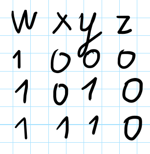

### Шаг 3. Сопоставление с исходной таблицей

Подставим эти строки рядом с таблицей из условия:

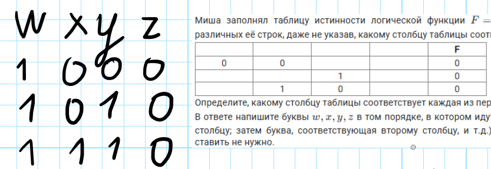

По условию, Миша перемешал столбцы и строки. Наша цель — определить, какая переменная (`x`, `y`, `z`, `w`) соответствует какому столбцу.

- Переменная `w` во всех трёх строках принимает значение **1**.  
  В исходной таблице **только четвёртый столбец** состоит полностью из единиц (остальные содержат хотя бы один 0).  
  ⇒ `w` → **столбец 4**.

- Переменная `z` во всех трёх строках равна **0**.  
  В первом столбце — только нули, во втором и третьем — есть единицы.  
  ⇒ `z` → **столбец 1**.

После этих привязок получаем:

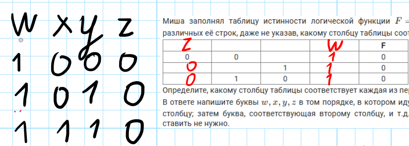

### Шаг 4. Определение оставшихся переменных (`x` и `y`)

Рассмотрим последнюю строку исходной таблицы: `[0, 0, 1, 1]`.  
Мы уже знаем, что четвёртая ячейка — это `w = 1`. Значит, вторая единица принадлежит либо `x`, либо `y`.

Сопоставим с нашей таблицей строк с `F = 0`. Такая же комбинация (`0, 1, 0, 1`) встречается во **второй строке**, где:
- `z = 0`
- `y = 1`
- `x = 0`
- `w = 1`

Следовательно:
- `y` → **столбец 2**
- `x` → **столбец 3**

Итоговое соответствие:

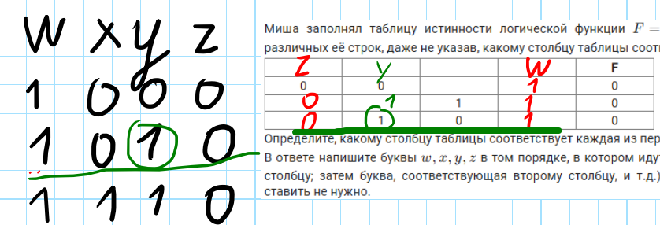

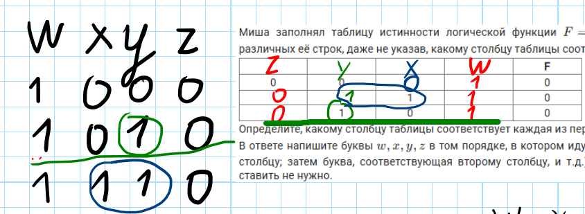

**Ответ:** `zyxw`


### Программное решение

Построим таблицу истинности сразу отфильтруем только те строки, в которых **результат функции равен 0** — именно они требуются по условию задачи.

```python
# Выводим заголовок таблицы: имена логических переменных
print('w x y z f')

# Перебираем все возможные значения переменной w (0 и 1)
for w in range(2):
    # Перебираем все возможные значения переменной x (0 и 1)
    for x in range(2):
        # Перебираем все возможные значения переменной y (0 и 1)
        for y in range(2):
            # Перебираем все возможные значения переменной z (0 и 1)
            for z in range(2):
                # Вычисляем значение логического выражения
                # ¬(x → y) преобразуется в not (x <= y)
                # (z == w) — эквиваленция
                # z — отдельный операнд в дизъюнкции
                f = not (x <= y) or (z == w) or z

                # Если результат выражения f равен 0 (ложь),
                if f == 0:
                    # выводим только подходящие наборы переменных
                    print(w, x, y, z,0)

```
w x y z f
1 0 0 0 0
1 0 1 0 0
1 1 1 0 0

После получения строк, где `F = 0`, выполняем те же логические шаги, что и при ручном решении.

Подставим найденные строки рядом с фрагментом таблицы из условия:


По условию, Миша заполнял таблицу истинности, но не завершил её и **перемешал столбцы и строки**. Наша задача — определить, какая переменная (`w`, `x`, `y`, `z`) соответствует какому столбцу.

- В наших трёх строках переменная `w` всегда равна **1**.  
  Среди столбцов в условии **только четвёртый** не содержит ни одного нуля — все его ячейки пусты, но по логике задачи именно туда может быть помещена `w`.  
  ⇒ `w` → **столбец 4**.

- Переменная `z` во всех трёх строках равна **0**.  
  Второй и третий столбцы содержат единицы, а **первый — только нули**.  
  ⇒ `z` → **столбец 1**.

После этих привязок получаем:


Остались переменные `x` и `y`. Обратим внимание на **последнюю строку** исходной таблицы: `[0, 0, 1, 1]`.  
Мы уже знаем, что четвёртая единица — это `w`. Значит, вторая единица принадлежит либо `x`, либо `y`.

Сравним с нашими строками, где `F = 0`. Такая же комбинация (`z=0, y=1, x=0, w=1`) встречается во **второй строке**, где значение `1` соответствует именно **`y`**.  
⇒ `y` → **столбец 2**,  
⇒ `x` → **столбец 3**.


**Ответ:** `zyxw`

### Продвинутое программное решение (для опытных)

Существует и **автоматизированный метод**, который сразу находит правильный порядок переменных без ручного анализа. Однако он требует уверенного владения Python, включая понимание:

- модуля `itertools`,
- функций `product` и `permutations`,
- распаковки аргументов,
- работы с именованными параметрами функций (`**kwargs`).

> ⚠️ **Внимание:** Этот код — "зрелище не для слабонервных". Используйте его только если вы уверенно ориентируетесь в продвинутых возможностях Python.

```python
# Импортируем две вспомогательные функции из модуля itertools:
# - product — для генерации всех возможных комбинаций значений (декартово произведение),
# - permutations — для перебора всех возможных порядков (перестановок) переменных.
from itertools import product, permutations

# Определяем логическую функцию f с четырьмя аргументами: x, y, w, z.
# В Python для логических выражений:
#   - x <= y эквивалентно импликации (x → y),
#   - not(x <= y) — значит ¬(x → y),
#   - (z == w) — эквивалентность,
#   - or z — дизъюнкция с переменной z.
def f(x, y, w, z):
    return not (x <= y) or (z == w) or z

# Перебираем все возможные значения для семи неизвестных битов: x1–x7
for x1, x2, x3, x4, x5, x6, x7 in product([0, 1], repeat=7):
    # Формируем "таблицу" из трёх строк с частично неизвестными значениями
    t = (
        (0, 0, x1, x2, 0),   # первая строка
        (x3, x4, 1, x5, 0),  # вторая строка
        (x6, 1, 0, x7, 0)    # третья строка
    )

    # Убеждаемся, что строки уникальны
    if len(t) == len(set(t)):
        # Перебираем все возможные перестановки имён переменных
        for p in permutations('xywz', r=4):
            # Проверяем, удовлетворяет ли текущая перестановка всем строкам
            if all(f(**dict(zip(p, line[:-1]))) == line[-1] for line in t):
                print(*p)  # Выводим найденный порядок — например: z y x w
**Ответ:** `zyxw`
