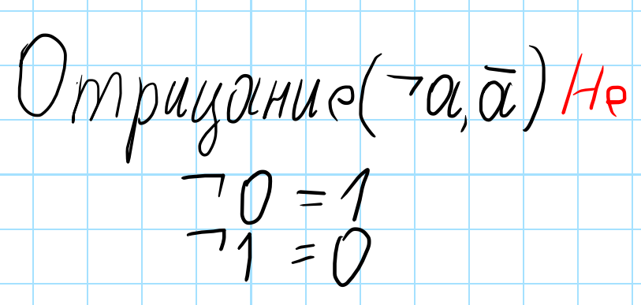
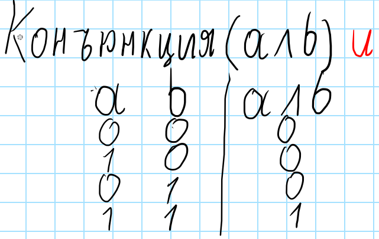
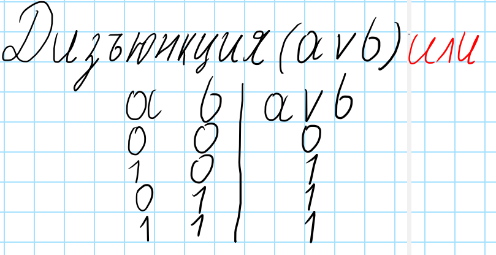
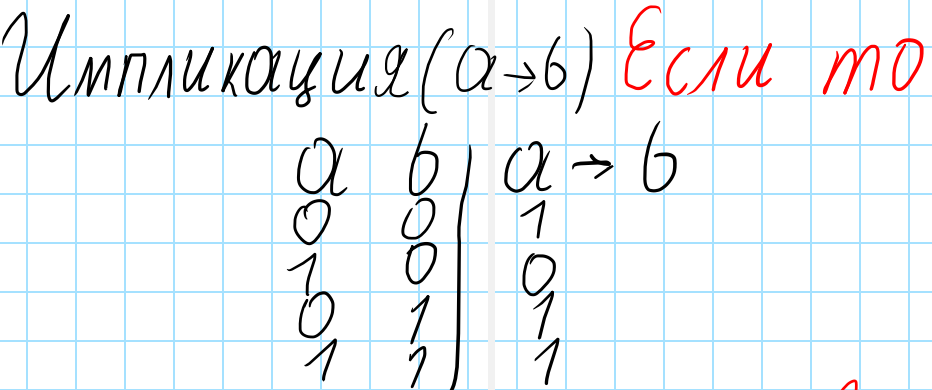
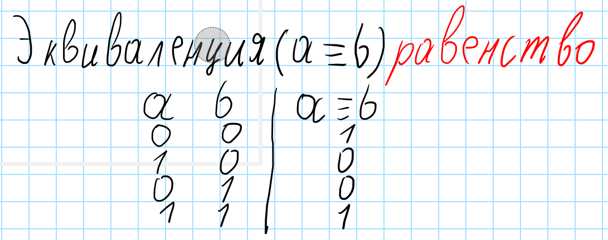

# Задание 2 — Таблицы истинности логических выражений

[← Назад ко всем заданиям](../../README.md)

**Теги:** Логика · Python · Таблицы истинности

---

## Основные логические операции

В математической логике используются два значения: **Истина** (`1`) и **Ложь** (`0`).

### 1. Отрицание (¬A, NOT)

Меняет значение на противоположное.

### 2. Конъюнкция (A ∧ B, AND)

Истинна только когда **оба** операнда истинны.

### 3. Дизъюнкция (A ∨ B, OR)

Ложна только когда **оба** операнда ложны.

### 4. Импликация (A → B)

Ложна **только** когда из истинного следует ложное.

### 5. Эквиваленция (A ↔ B)

Истинна когда оба высказывания **одинаковы** по значению.

---

## Логические операции в Python

| Логическая операция | Python |
|:---|:---|
| Отрицание (¬A) | `not A` |
| Конъюнкция (A ∧ B) | `A and B` |
| Дизъюнкция (A ∨ B) | `A or B` |
| Импликация (A → B) | `A <= B` |
| Эквиваленция (A ↔ B) | `A == B` |

### Приоритет операций

1. `(...)` — скобки
2. `not`
3. `and`
4. `or`
5. `<=` (импликация)
6. `==` (эквиваленция)

> ⚠️ **Важно!** В Python `<=` и `==` имеют **более высокий приоритет**, чем `and` и `or`. Это отличается от математической логики — используй скобки!
