{
 "cells": [
  {
   "cell_type": "markdown",
   "id": "77518da7-bf1b-40e2-9444-468b0a1ce840",
   "metadata": {},
   "source": [
    "# Лекция по заданию 23 из ЕГЭ по информатике\n",
    "\n",
    "## Общая характеристика задания\n",
    "\n",
    "**Тип задач:** Анализ зависимостей и временных характеристик процессов\n",
    "**Метод решения:** Ручное решение с использованием электронных таблиц\n",
    "\n",
    "## Разбор на примере двух задач\n",
    "\n",
    "### Задача 1: Демоверсия 2026 (Уровень: Базовый)\n",
    "\n",
    "#### Условие задачи\n",
    "\n",
    "В файле содержится информация о совокупности N вычислительных процессов, которые могут выполняться параллельно или последовательно.\n",
    "Приостановка выполнения процесса не допускается. Будем говорить, что процесс B зависит от процесса A, если для выполнения процесса B необходимы результаты выполнения процесса A. В этом случае процессы A и B могут выполняться только последовательно. \n",
    "Информация о процессах представлена в файле в виде таблицы. В первом столбце таблицы указан идентификатор процесса (ID), во втором столбце таблицы – время его выполнения в миллисекундах, в третьем столбце перечислены с разделителем «;» ID процессов, от которых зависит данный процесс. Если процесс независимый, то в таблице указано значение 0.\n",
    "Определите максимальное количество процессов, которые могут быть завершены за первые 17 мс. Считать, что каждый процесс начинается в самое раннее допустимое время. Нумерация миллисекунд начинается с 1. \n",
    "\n",
    "Файлы к заданию: https://kompege.ru/files/sReBw6q75d.ods\n",
    "\n",
    "#### Пошаговое решение\n",
    "\n",
    "**Шаг 1: Открываем и изучаем файл**\n",
    "\n",
    "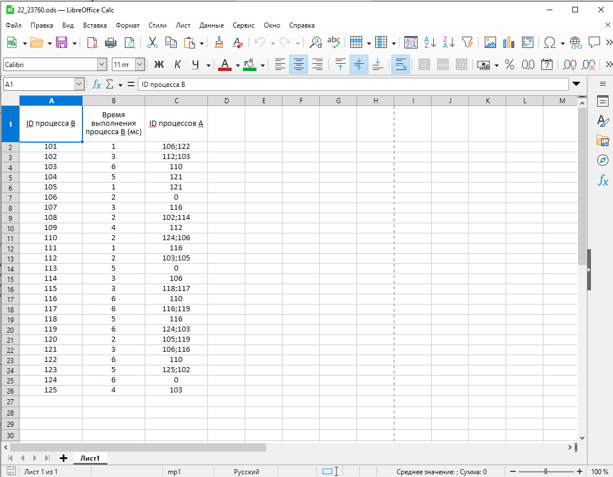\n",
    "\n",
    "**Шаг 2: Анализируем структуру данных**\n",
    "\n",
    "**Столбец A - идентификаторы процессов:**\n",
    "\n",
    "\n",
    "\n",
    "**Столбец B - время выполнения:**\n",
    "\n",
    "\n",
    "\n",
    "**Столбец C - зависимости между процессами:**\n",
    "\n",
    "\n",
    "\n",
    "**Важное замечание:** Количество зависимостей у процесса может варьироваться от 0 до 2.\n",
    "\n",
    "**Шаг 3: Разделяем зависимости на отдельные столбцы**\n",
    "\n",
    "Используем функцию \"Текст по столбцам\" для разделения зависимостей:\n",
    "\n",
    "\n",
    "\n",
    "**Объяснение:** Эта операция позволяет обрабатывать каждую зависимость отдельно, что упрощает последующие вычисления.\n",
    "\n",
    "**Шаг 4: Заполняем пустые ячейки**\n",
    "\n",
    "Все пустоты в столбце D заполняем значением 0:\n",
    "\n",
    "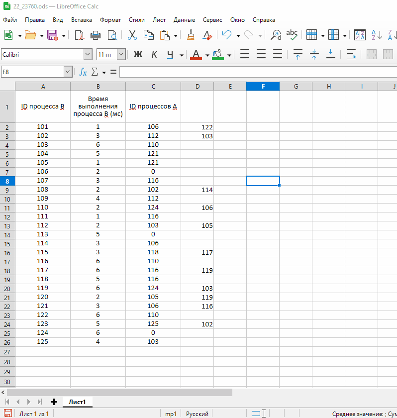\n",
    "\n",
    "**Объяснение:** Значение 0 указывает на отсутствие второй зависимости. Пустые ячейки могут вызвать ошибки в вычислениях.\n",
    "\n",
    "**Шаг 5: Подготавливаем дополнительные столбцы для расчетов**\n",
    "\n",
    "Добавляем столбцы E, F и G для промежуточных вычислений:\n",
    "\n",
    "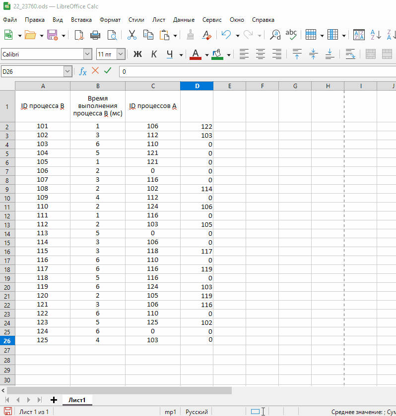\n",
    "\n",
    "**Шаг 6: Создаем виртуальный \"нулевой\" процесс**\n",
    "\n",
    "Добавляем запись для процесса с ID = 0:\n",
    "\n",
    "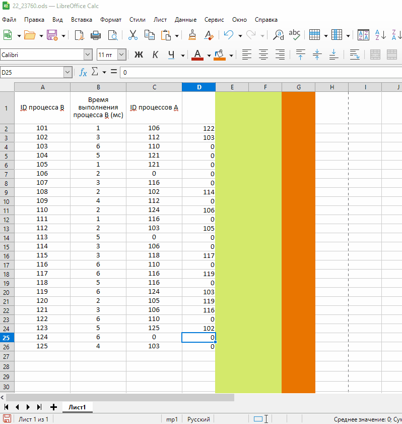\n",
    "\n",
    "**Объяснение:** Этот шаг необходим для корректного расчета процессов, которые не имеют зависимостей (указаны как 0).\n",
    "\n",
    "**Шаг 7: Рассчитываем общее время выполнения**\n",
    "\n",
    "В столбце G вычисляем итоговое время завершения каждого процесса:\n",
    "\n",
    "Формула: МАКС(E2:F2) + B2\n",
    "\n",
    "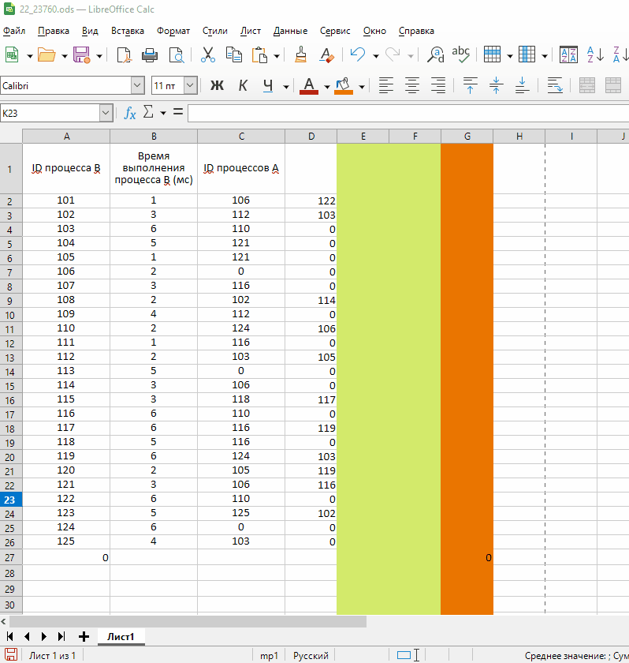\n",
    "\n",
    "**Объяснение:** \n",
    "- МАКС(E2:F2) - находим максимальное время завершения среди всех зависимостей\n",
    "- + B2 - добавляем собственное время выполнения процесса\n",
    "- Это гарантирует, что процесс начнется только после завершения всех своих зависимостей\n",
    "\n",
    "**Шаг 8: Заполняем столбцы зависимостей**\n",
    "\n",
    "В столбцах E и F указываем время завершения процессов-зависимостей:\n",
    "\n",
    "**Алгоритм заполнения:**\n",
    "- Для столбца E: находим время завершения процесса из столбца C\n",
    "- Для столбца F: находим время завершения процесса из столбца D\n",
    "- Используем функции поиска для автоматического заполнения"
   ]
  },
  {
   "cell_type": "code",
   "execution_count": null,
   "id": "074805e7-7614-458d-aaa4-0c75ed1c2faa",
   "metadata": {},
   "outputs": [],
   "source": [
    "=ВПР(C2;$A:$G;7;0)"
   ]
  },
  {
   "cell_type": "markdown",
   "id": "ad0e4da4-7005-4f35-ad57-eb93bc299f13",
   "metadata": {},
   "source": [
    "**Шаг 9: Автоматизация поиска времени зависимостей**\n",
    "\n",
    "Заполняем столбцы E и F с помощью функции ВПР:\n",
    "\n",
    "\n",
    "\n",
    "**Объяснение:** \n",
    "- Функция ВПР ищет значение из столбца C в таблице процессов и возвращает соответствующее время завершения из столбца G\n",
    "- Аналогично для столбца F и зависимостей из столбца D\n",
    "- Это позволяет автоматически определить, когда завершатся все процессы-предшественники\n",
    "\n",
    "**Шаг 10: Анализ результатов и подсчет процессов**\n",
    "\n",
    "Выполняем сортировку процессов по времени завершения (столбец G) в порядке возрастания:\n",
    "\n",
    "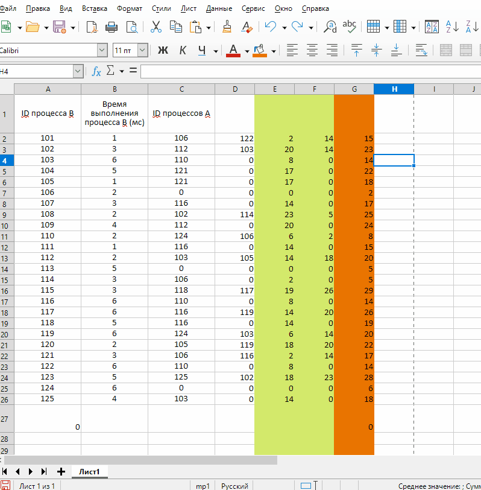\n",
    "\n",
    "**Объяснение:** Сортировка позволяет наглядно увидеть, какие процессы завершаются раньше других.\n",
    "\n",
    "**Шаг 11: Определение количества процессов, завершающихся за 17 мс**\n",
    "\n",
    "Анализируем отсортированный список и подсчитываем процессы с временем завершения ≤ 17:\n",
    "\n",
    "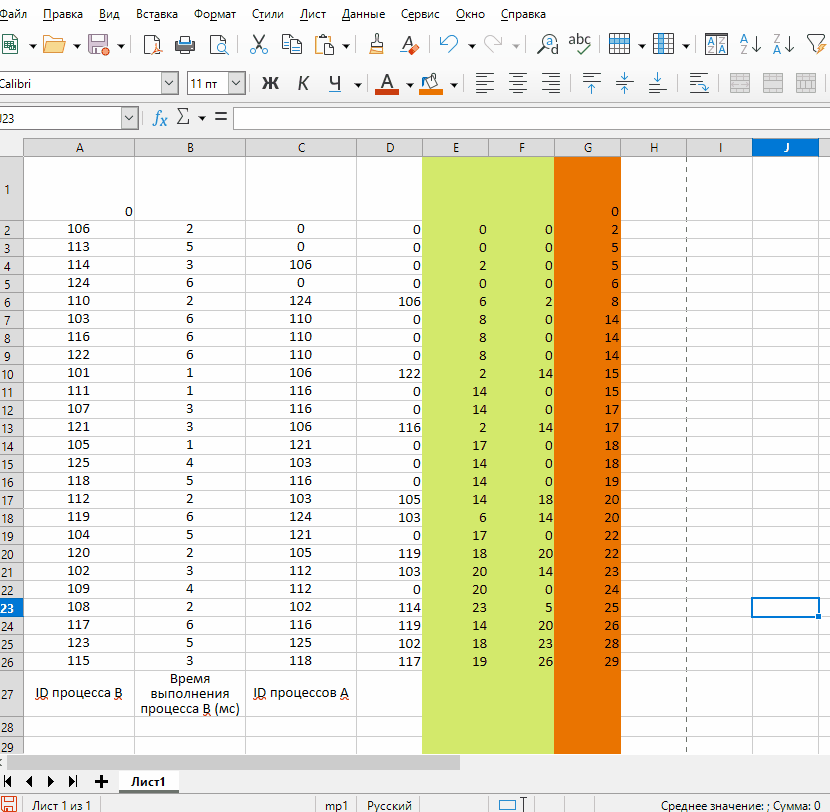\n",
    "\n",
    "**Результат:** Как видно из таблицы, всего 12 процессов завершаются за первые 17 миллисекунд.\n",
    "\n",
    "## Ответ: 12\n",
    "\n",
    "### Ключевые моменты решения:\n",
    "\n",
    "1. **Разделение зависимостей** - преобразуем сложную структуру зависимостей в простую табличную форму\n",
    "2. **Рекурсивный расчет времени** - время начала процесса зависит от времени завершения всех его предшественников\n",
    "3. **Использование виртуального нулевого процесса** - упрощает обработку независимых процессов\n",
    "4. **Сортировка и визуальный анализ** - позволяет быстро определить количество процессов, удовлетворяющих условию\n",
    "\n",
    "Данный метод эффективен для решения задач данного типа и может быть адаптирован для различных вариаций условий."
   ]
  },
  {
   "cell_type": "markdown",
   "id": "63b366de-19a6-41c6-86e7-976a3c54b039",
   "metadata": {},
   "source": [
    "### Задача 2\n",
    "\n",
    "#### Условие задачи\n",
    "\n",
    "Определите максимальное количество процессов, которые могут начаться не ранее чем с 8-й мс от начала отсчёта. Считать, что каждый процесс начинается в самое раннее допустимое время. Нумерация миллисекунд начинается с 1.\n",
    "Например, для приведённой таблицы максимальное количество процессов, которые могут начаться не ранее чем с 6-й мс, равно 2. Это процессы 3 (начинается с 8-й мс) и 5 (наяинается с 6-й мс).\n",
    "\n",
    "Типовой пример имеет иллюстративный характер. Для выполнения задания используйте данные из прилагаемого файла.\n",
    "\n",
    "Файлы к заданию: https://kompege.ru/files/L0TL8VWeR.xls\n",
    "\n",
    "#### Пошаговое решение\n",
    "\n",
    "**Шаг 1: Подготовка файла**\n",
    "\n",
    "Скачиваем и открываем файл с исходными данными:\n",
    "\n",
    "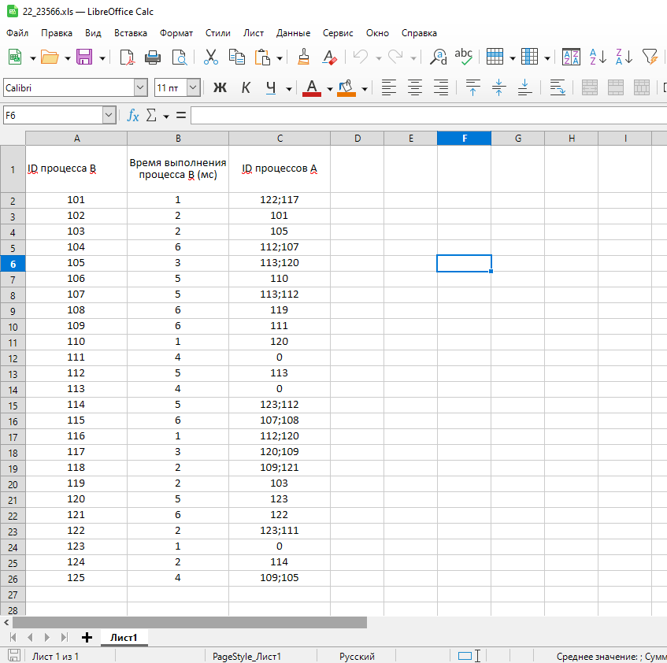\n",
    "\n",
    "**Шаг 2: Анализ структуры данных**\n",
    "\n",
    "Изучаем столбцы с данными:\n",
    "\n",
    "**Столбец A - идентификаторы процессов:**\n",
    "\n",
    "\n",
    "\n",
    "**Столбец B - время выполнения процессов:**\n",
    "\n",
    "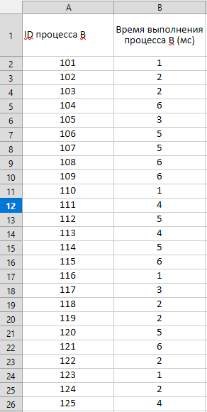\n",
    "\n",
    "**Столбец C - зависимости между процессами:**\n",
    "\n",
    "\n",
    "\n",
    "**Объяснение:** Как и в предыдущей задаче, процессы могут иметь от 0 до 2 зависимостей.\n",
    "\n",
    "**Шаг 3: Разделение зависимостей**\n",
    "\n",
    "Используем функцию \"Текст по столбцам\" для разделения зависимостей на отдельные столбцы:\n",
    "\n",
    "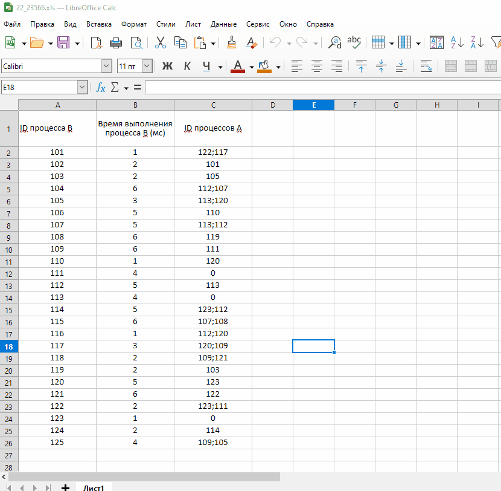\n",
    "\n",
    "**Шаг 4: Заполнение пустых значений**\n",
    "\n",
    "Все пустые ячейки в столбце D заполняем нулями:\n",
    "\n",
    "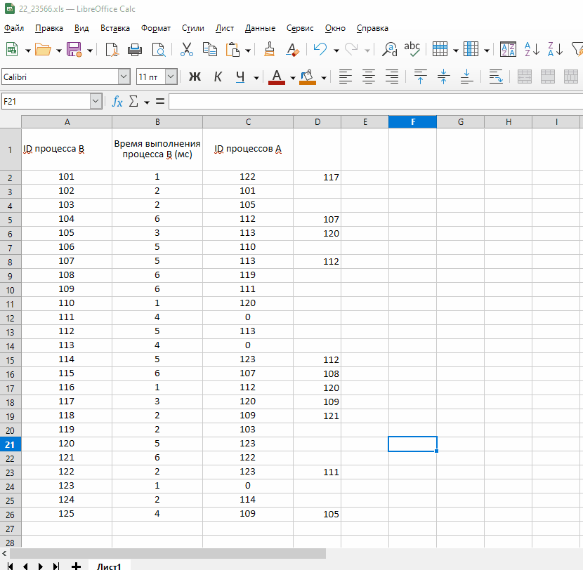\n",
    "\n",
    "**Объяснение:** Это гарантирует корректную обработку процессов с одной зависимостью.\n",
    "\n",
    "**Шаг 5: Создание столбцов для расчетов**\n",
    "\n",
    "Добавляем столбцы E, F и G для промежуточных вычислений:\n",
    "\n",
    "\n",
    "\n",
    "**Шаг 6: Создание виртуального нулевого процесса**\n",
    "\n",
    "Добавляем запись для процесса с ID = 0:\n",
    "\n",
    "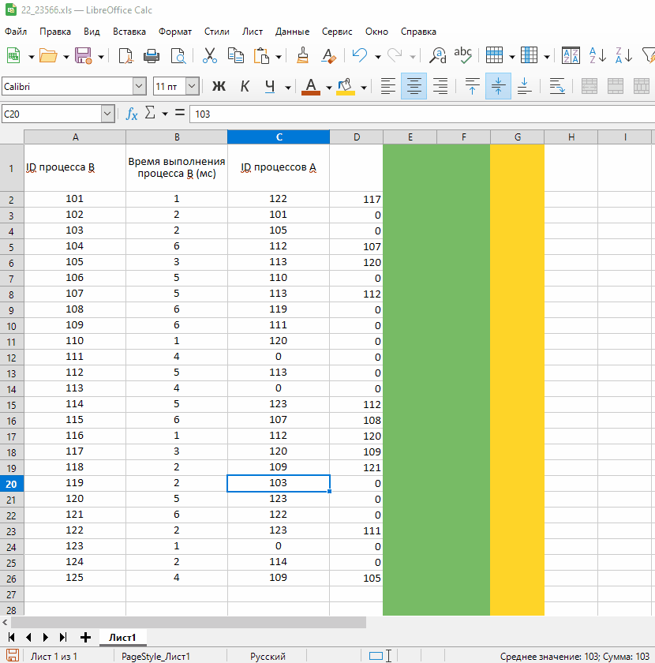\n",
    "\n",
    "**Объяснение:** Нулевой процесс служит точкой отсчета для независимых процессов.\n",
    "\n",
    "**Шаг 7: Расчет времени завершения процессов**\n",
    "\n",
    "В столбце G вычисляем общее время завершения каждого процесса:\n",
    "\n",
    "Формула: `=МАКС(E2:F2) + B2`\n",
    "\n",
    "\n",
    "\n",
    "**Объяснение:** \n",
    "- `МАКС(E2:F2)` - определяем, когда завершится самая поздняя зависимость\n",
    "- `+ B2` - добавляем собственное время выполнения процесса\n",
    "- Результат - время завершения процесса относительно начала отсчета\n",
    "\n",
    "**Шаг 8: Расчет времени начала процессов**\n",
    "\n",
    "**Важное отличие от предыдущей задачи:** Нам нужно найти не время завершения, а время начала процессов.\n",
    "\n",
    "Для этого создадим дополнительный столбец H \"Время начала\":\n",
    "\n",
    "Формула: `=МАКС(E2:F2) + 1`\n",
    "\n",
    "**Объяснение:** \n",
    "- Процесс начинается сразу после завершения всех своих зависимостей\n",
    "- `+1` учитывает, что если зависимость завершилась в момент X, то следующий процесс может начаться только в момент X+1\n",
    "- Это соответствует условию \"нумерация миллисекунд начинается с 1\""
   ]
  },
  {
   "cell_type": "code",
   "execution_count": null,
   "id": "a40fd14f-44c1-428b-9667-a8eb3c03e489",
   "metadata": {},
   "outputs": [],
   "source": [
    "=ВПР(C2;$A:$G;7;0)"
   ]
  },
  {
   "cell_type": "markdown",
   "id": "71d9c7de-a72e-46df-9b3f-563ca2ffa575",
   "metadata": {},
   "source": [
    "**Шаг 9: Расчет времени начала процессов**\n",
    "\n",
    "Заполняем столбцы E и F с помощью функции ВПР для определения времени завершения зависимостей:\n",
    "\n",
    "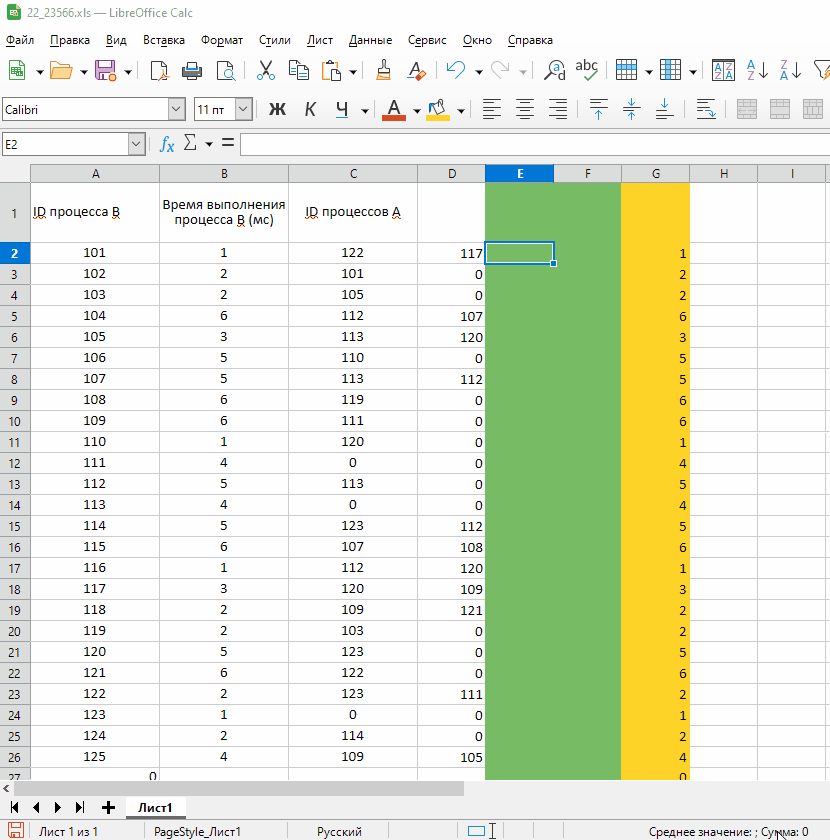\n",
    "\n",
    "**Объяснение:** \n",
    "- Функция ВПР находит время завершения для каждого процесса-зависимости\n",
    "- Это необходимо для определения самого позднего времени завершения среди всех предшественников\n",
    "\n",
    "**Шаг 10: Определение времени старта процесса**\n",
    "\n",
    "Создаем столбец для времени начала процесса. Формула: `=МАКС(E2:F2)`\n",
    "\n",
    "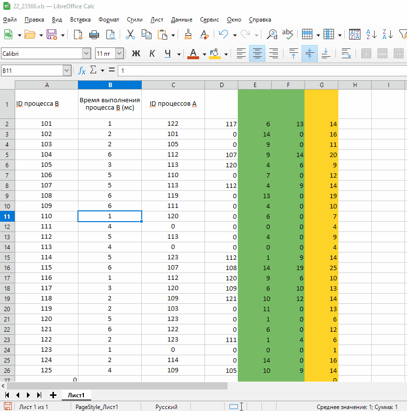\n",
    "\n",
    "**Объяснение:** \n",
    "- Время начала процесса равно максимальному времени завершения среди всех его зависимостей\n",
    "- Если процесс не имеет зависимостей (значение 0), он начинается с 1-й миллисекунды\n",
    "\n",
    "**Шаг 11: Корректировка времени начала**\n",
    "\n",
    "Добавляем +1 к времени начала, чтобы учесть особенности нумерации:\n",
    "\n",
    "\n",
    "\n",
    "**Объяснение:** \n",
    "- Если зависимость завершилась в момент X, то следующий процесс может начаться только в момент X+1\n",
    "- Это соответствует логике \"нумерация миллисекунд начинается с 1\"\n",
    "\n",
    "**Шаг 12: Сортировка процессов по времени начала**\n",
    "\n",
    "Выполняем сортировку процессов по времени начала в порядке возрастания:\n",
    "\n",
    "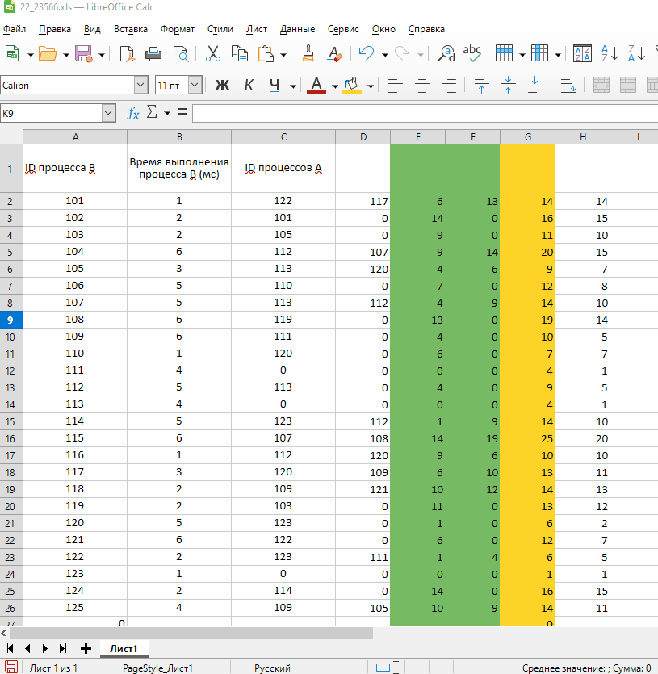\n",
    "\n",
    "**Объяснение:** Сортировка позволяет наглядно увидеть распределение процессов по времени начала.\n",
    "\n",
    "**Шаг 13: Анализ результатов и подсчет ответа**\n",
    "\n",
    "Определяем количество процессов, которые начинаются не ранее 8-й миллисекунды:\n",
    "\n",
    "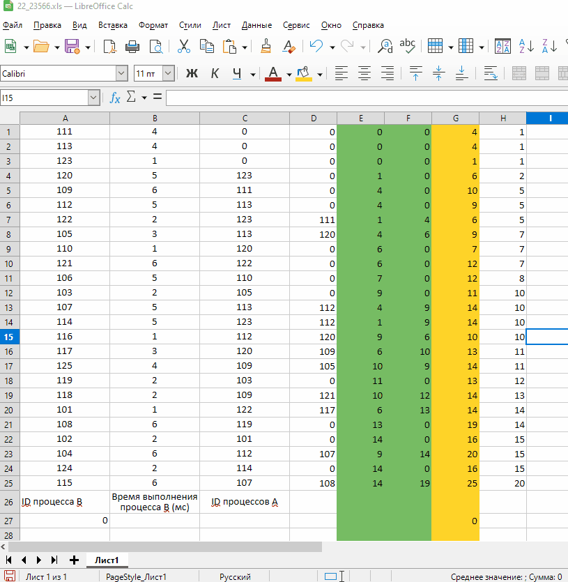\n",
    "\n",
    "**Результат:** Как видно из отсортированной таблицы, 15 процессов начинаются с 8-й миллисекунды или позже.\n",
    "\n",
    "## Ответ: 15\n",
    "\n",
    "### Итоговый алгоритм решения:\n",
    "\n",
    "1. **Разделение зависимостей** - преобразование сложных зависимостей в табличный формат\n",
    "2. **Расчет времени завершения зависимостей** - использование ВПР для определения когда завершаются процессы-предшественники\n",
    "3. **Определение времени начала** - максимальное время завершения зависимостей + 1\n",
    "4. **Сортировка и анализ** - визуальное определение процессов, удовлетворяющих условию\n",
    "\n",
    "**Ключевой момент:** В отличие от предыдущей задачи, здесь мы работаем с временем начала процессов, а не их завершения, что требует смещения на +1 миллисекунду."
   ]
  }
 ],
 "metadata": {
  "kernelspec": {
   "display_name": "Python 3 (ipykernel)",
   "language": "python",
   "name": "python3"
  },
  "language_info": {
   "codemirror_mode": {
    "name": "ipython",
    "version": 3
   },
   "file_extension": ".py",
   "mimetype": "text/x-python",
   "name": "python",
   "nbconvert_exporter": "python",
   "pygments_lexer": "ipython3",
   "version": "3.13.5"
  }
 },
 "nbformat": 4,
 "nbformat_minor": 5
}
